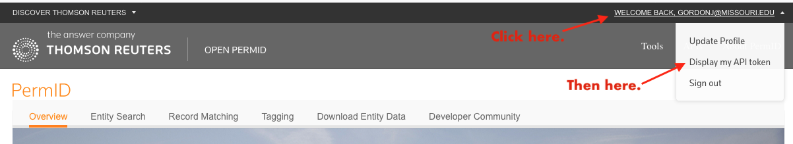

# Chatter

Twitter monitoring, aggregation and trending for local news.

Chatter helps you track stories popular on Twitter that are:

- Tweeted by users in a specified geography
- Published under a domain that you care about

## Bootstrapping a local dev instance

Install dependencies:

```sh
source install.sh
```

Create database:

```sh
createdb {your database name}
```

And set it up:

```sh
psql --dbname={your database name} --file=database/schema.sql
```

Create a copy of the config file for your local development instance:

```sh
cp chatter/config/config.yaml chatter/config/local_config.yaml
```

Open `chatter/config/local_config.yaml` and fill in all the necessary configurations.

You'll need credentials for Twitter's API. If you haven't already [apply](https://developer.twitter.com/en/apply-for-access) for a Twitter developer account, then create an app on that account called Chatter.

You'll also need an API token for OpenCalais. To get one, [register](https://login.thomsonreuters.com/iamui/UI/createUser?app_id=Bold&realm=Bold&lang=en) for Open PermID/Open Calais. Then log into your account and click on your user name in the upper right corner. Then select "Display my API token".



We can test our new instance by checking to see what our current Twitter rate limits are:

```sh
chatter twitterrl -co local_config.yaml
```

The output should look something like this:

```sh
2019-09-09 11:50:31,130: Successfully loaded Chatter configuration from /Users/gordo/Devel/Chatter/chatter/config
('/lists/list', {'limit': 15, 'remaining': 15, 'reset': 1568048731})
('/lists/memberships', {'limit': 75, 'remaining': 75, 'reset': 1568048731})
('/lists/subscribers/show', {'limit': 15, 'remaining': 15, 'reset': 1568048731})
('/lists/members', {'limit': 75, 'remaining': 75, 'reset': 1568048731})
('/lists/subscriptions', {'limit': 15, 'remaining': 15, 'reset': 1568048731})
('/lists/show', {'limit': 75, 'remaining': 75, 'reset': 1568048731})
('/lists/ownerships', {'limit': 15, 'remaining': 15, 'reset': 1568048731})
('/lists/subscribers', {'limit': 15, 'remaining': 15, 'reset': 1568048731})
('/lists/members/show', {'limit': 15, 'remaining': 15, 'reset': 1568048731})
('/lists/statuses', {'limit': 900, 'remaining': 900, 'reset': 1568048731})
('/search/tweets', {'limit': 450, 'remaining': 450, 'reset': 1568048731})
```

## Managing domains

Say you only want to track the popularity of stories published by the news organizations run by the Missouri School of Journalism at Columbia.

You would start by creating a csv file (call it 'mu-sites.csv') with three columns (without headers):

```
Mizzou,https://www.columbiamissourian.com,newspaper  
Mizzou,https://www.kbia.org,broadcaster
Mizzou,https://www.komu.com,broadcaster
Mizzou,https://www.missouribusinessalert.com,newsite
```

The first and third columns map to `domain_set` and `subset`, respectively, which can be useful for breaking down your analysis results. Each row must have a `domain_set` value, but `subset` is not required.

Also note that the `domain` values (second column) must include the subdomain (e.g., `www`) under which a whitelisted site will publish their articles.

Once your csv file is defined, you can then load those domains into Chatter:

```sh
chatter domains mu-sites.csv -co local_config.yaml
```

You can add more domains at anytime. Chatter will update the `domain_set` and `subset` values for any previously loaded domains and insert any new ones.

When invoked with the `-r` flag, the `domains` command will remove all existing domains before loading new ones.

## User maintainence

## List maintainence

## Capturing tweets

### By geography

```sh
chatter geocapture 38.9364149 -92.6513689 100000 -co local_config.yaml
```

### By list


## URL maintainence


## Hot URLs


